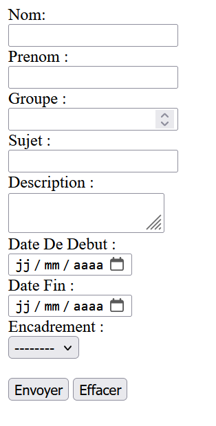

# TP 2 - Formulaire de Projet

Ce TP est une page HTML contenant un formulaire permettant de renseigner des informations sur un projet.

##  Fonctionnalités
- Champs pour saisir le nom, prénom, groupe, sujet et description du projet.
- Sélection des dates de début et de fin du projet.
- Liste déroulante pour choisir un encadrant.
- Boutons de soumission et de réinitialisation du formulaire.

##  Technologies utilisées
- HTML5

##  Structure du projet
- `index.html` : Contient le formulaire.

##  Aperçu

##  Utilisation
1. Ouvrir le fichier `index.html` dans un navigateur.
2. Remplir les informations requises.
3. Cliquer sur "Submit" pour envoyer ou "Reset" pour réinitialiser.
